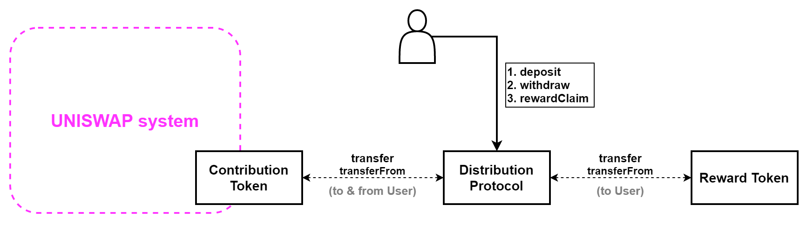

# BiFi-staking-protocol

## Introduction
This smart contract implements a token staking service. Two types of tokens are involved in the staking service: (1) Contribution Token and (2) Reward Token. When a user deposits his or her Contribution Tokens to our smart contract, the user can earn Reward Tokens relative to the deposited amount and the length of deposit. Both the Contribution Tokens and Reward Tokens are ERC-20 tokens.

## Architecture

